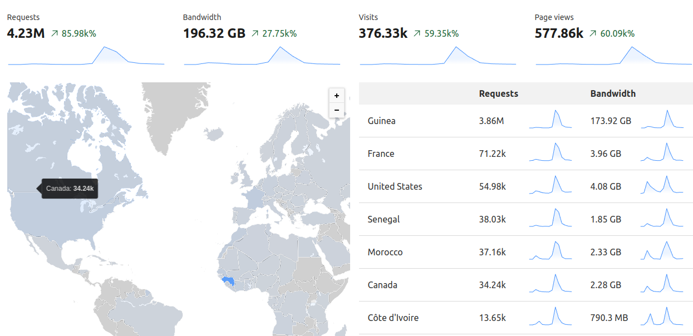
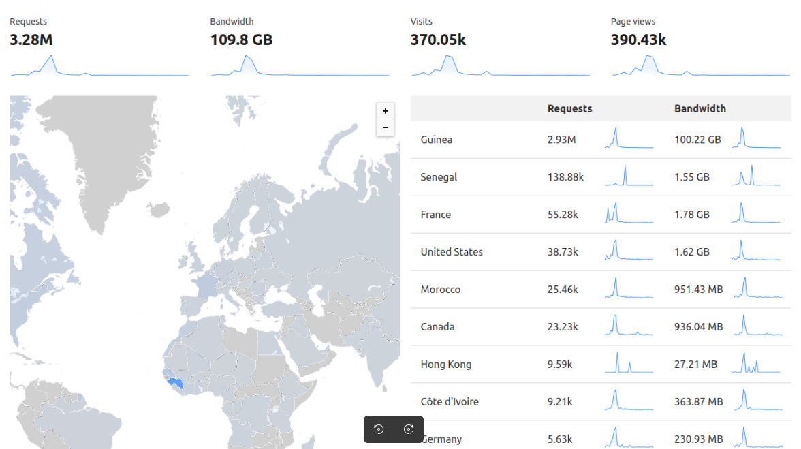
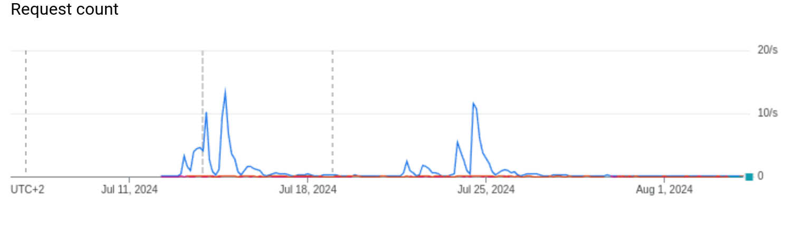
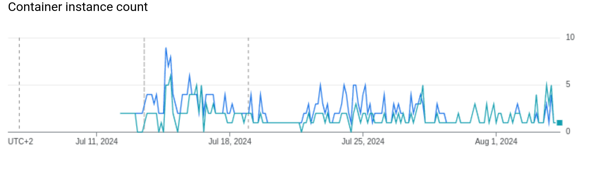

# GuineeExamen

GuineeExamen révolutionne l'accès aux résultats des examens nationaux (BAC, BEPC, CEE) en Guinée.

## Fonctionnalités principales

- ✅ Vérification gratuite et rapide des admissions
- 📊 Téléchargement des listes d'admis par école ou centre d'examen (avec classement et décompte des mentions)
- 🎓 Génération de résumés d'admission

## Solutions apportées

1. **Gratuité et Accessibilité** : Fin de la facturation abusive pour la consultation des résultats
2. **Accessibilité Universelle** : Consultation depuis n'importe quel appareil, opérateur ou lieu
3. **Transparence** : Vérification facile des résultats par les parents/tuteurs
4. **Efficacité Administrative** : Réduction drastique de la charge de travail des écoles
5. **Lutte contre la Fraude** : Détection a priori des fraudes dans les centres d'examen
6. **Archivage Numérique** : Historique des résultats facilement consultable
7. **Performance** : Service haute disponibilité, réduisant stress et attente
8. **Sécurité** : Protection contre les attaques DDoS et autres menaces

## Prochaines Étapes

- [ ] Documentation API pour intégration tierce
- [ ] Cession au MEPU-A Guinée
- [ ] Publication en Open Source

## Statistiques d'utilisation

🚀 **Lancement** : 06 juillet 2024
👥 **Visites** : Plus de 745 000 (06 juillet - 18 août 2024)

### Aperçu Cloudflare (06 - 18 juillet 2024)

### Aperçu Cloudflare (18 juillet - 17 août 2024)

### Statistiques Google Cloud Platform (06 juillet - 08 août 2024)

#### Nombre de requêtes

#### Utilisation des conteneurs

## Retours Utilisateurs

Découvrez les témoignages sur notre [page Facebook Guinify](https://www.facebook.com/profile.php?id=61561663888377).

---

© 2024 GuineeExamen - Tous droits réservés
